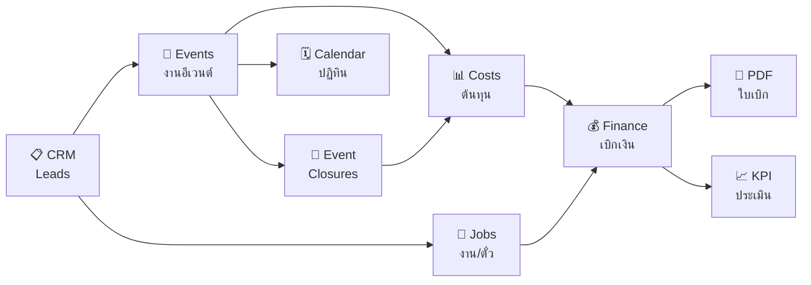

# 📊 STOCK-MIMAGE Project Analysis

> วิเคราะห์เมื่อ: 3 มีนาคม 2569 | Next.js 16.1.6 + Supabase + Tailwind v4

---

## 🏗️ ภาพรวมโปรเจค

| Metric                     | Value                   |
| -------------------------- | ----------------------- |
| **ไฟล์ทั้งหมด (TS/TSX)**   | 178 ไฟล์                |
| **โค้ดทั้งหมด**            | ~44,180 บรรทัด          |
| **Server Actions**         | ~4,131 บรรทัด (11 ไฟล์) |
| **หน้า (Pages)**           | 62 หน้า                 |
| **UI Components (shadcn)** | 21 components           |
| **โมดูลหลัก**              | 13 โมดูล                |

---

## 🧩 โมดูลทั้งหมด (13 โมดูล)

| โมดูล               | ไฟล์ | Actions (บรรทัด) | คำอธิบาย                        |
| ------------------- | ---- | ---------------- | ------------------------------- |
| **Jobs** 🏢         | 17   | 1,086            | ระบบงาน, Kanban Board, Tickets  |
| **CRM** 📋          | 20   | 849              | ลูกค้า, Leads, Pipeline, Kanban |
| **Finance** 💰      | 22   | 633              | ใบเบิก, อนุมัติ, PDF, เบิกจ่าย  |
| **KPI** 📈          | 19   | 470              | เทมเพลต, ประเมิน, รายงาน        |
| **Costs** 📊        | 18   | 353              | ต้นทุน, รายรับ, Import Event    |
| **Events** 🎪       | 17   | 289              | อีเวนต์, ปฏิทิน, ปิดงาน         |
| **Kits** 📦         | 18   | 61               | ชุดอุปกรณ์, เช็คของ, พิมพ์      |
| **Items** 🔧        | 10   | 91               | อุปกรณ์, สถานะ, Serial          |
| **Example Kits** 📄 | 9    | 103              | เทมเพลตชุดอุปกรณ์               |
| **Users** 👥        | 5    | 141              | จัดการผู้ใช้, Role              |
| **Logs** 📝         | 3    | —                | ประวัติการใช้งาน                |
| **Security** 🔒     | 3    | —                | ความปลอดภัย                     |
| **Dashboard** 🏠    | 1    | —                | หน้าหลัก                        |

---

## 🛠️ Tech Stack

### Core

| Technology       | Version | Role                               |
| ---------------- | ------- | ---------------------------------- |
| **Next.js**      | 16.1.6  | Framework (App Router + Turbopack) |
| **React**        | 19.2.4  | UI Library                         |
| **Tailwind CSS** | v4      | Styling                            |
| **Supabase**     | —       | Database + Auth + Storage          |

### UI & Components

| Library                       | Purpose                     |
| ----------------------------- | --------------------------- |
| **shadcn/ui** (21 components) | Design System (Radix-based) |
| **Lucide React**              | Icons                       |
| **Recharts** 3.7              | Charts & Analytics          |
| **Sonner** 2.0                | Toast Notifications         |
| **cmdk** 1.1                  | Command Palette / Combobox  |

### Utilities

| Library    | Purpose              |
| ---------- | -------------------- |
| **xlsx**   | Excel Export         |
| **jsPDF**  | PDF Generation       |
| **QRCode** | QR Code on Documents |
| **clsx**   | Class Merging        |

---

## 📐 Architecture Analysis

### ✅ จุดแข็ง (Strengths)

**1. Modern Stack — ล่าสุดมาก**

- Next.js 16 + React 19 + Tailwind v4 ใช้เทคโนโลยีล่าสุด
- Turbopack build เร็ว ~10 วินาที
- App Router + Server Actions pattern

**2. Modular Architecture — แยกโมดูลชัดเจน**

- แต่ละโมดูลมี `actions.ts` (Server Actions) แยกอิสระ
- File-based routing ตาม Next.js convention
- แยก `page.tsx` (server) กับ `*-view.tsx` (client) ชัดเจน

**3. Full-Featured Business App — ครบวงจร**

```
CRM → Lead → Event → Job → Costs → Finance → KPI
     ↑                                         ↓
     └─────── Complete Business Lifecycle ──────┘
```

- วงจรธุรกิจครบ ตั้งแต่ลูกค้าถึงประเมินผล
- Kanban Boards ทั้ง CRM และ Jobs
- PDF Generation พร้อม QR Code
- Multi-format Export (CSV, XLSX, PDF)

**4. Security — ระบบความปลอดภัยหลายชั้น**

- Supabase RLS + Service Role Key pattern
- Session-based authentication (cookie)
- Admin-only restrictions on sensitive actions
- Activity logging ทุก action สำคัญ

**5. Localization — รองรับ 2 ภาษา**

- Thai / English
- Buddhist Era calendar (พ.ศ.)
- Thai-localized UX Writing

### 📋 โอกาสในการปรับปรุง

**1. Server Actions ขนาดใหญ่**
| ไฟล์ | บรรทัด | สถานะ |
|---|---|---|
| jobs/actions.ts | 1,086 | ⚠️ ควรแยก |
| crm/actions.ts | 849 | ⚠️ ควรแยก |
| finance/actions.ts | 633 | ✅ OK |

> 💡 ไฟล์ที่เกิน 500 บรรทัด สามารถแยก domain logic ออกเป็น sub-files เช่น `jobs/actions/tickets.ts`, `jobs/actions/kanban.ts`

**2. Type Safety**

- มี `database.types.ts` แต่บาง action ยังใช้ `as any`
- สามารถ generate types จาก Supabase CLI ให้ auto-sync

**3. Testing**

- ยังไม่มี unit tests / integration tests
- Server Actions หลายตัวมี business logic ซับซ้อนที่ควร test

**4. Error Handling**

- บาง action return `{ error: string }` บ้าง `throw Error` บ้าง
- ควร standardize error pattern ให้เป็นแบบเดียวกัน

---

## 📊 Module Complexity Score

```
Jobs        ████████████████████ 1,086 LOC  ⭐⭐⭐⭐⭐
CRM         ███████████████░░░░░   849 LOC  ⭐⭐⭐⭐
Finance     ████████████░░░░░░░░   633 LOC  ⭐⭐⭐⭐
KPI         █████████░░░░░░░░░░░   470 LOC  ⭐⭐⭐
Costs       ███████░░░░░░░░░░░░░   353 LOC  ⭐⭐⭐
Events      █████░░░░░░░░░░░░░░░   289 LOC  ⭐⭐
Users       ███░░░░░░░░░░░░░░░░░   141 LOC  ⭐
ExampleKits ██░░░░░░░░░░░░░░░░░░   103 LOC  ⭐
Items       ██░░░░░░░░░░░░░░░░░░    91 LOC  ⭐
Kits        █░░░░░░░░░░░░░░░░░░░    61 LOC  ⭐
Profile     █░░░░░░░░░░░░░░░░░░░    55 LOC  ⭐
```

---

## 🔗 Data Flow Architecture



---

## 🎯 สรุป

| ด้าน                     | คะแนน         | หมายเหตุ                                 |
| ------------------------ | ------------- | ---------------------------------------- |
| **Tech Stack**           | 9/10          | ล่าสุดมาก, production-ready              |
| **Architecture**         | 8/10          | Modular ดี, บาง action ควรแยก            |
| **Feature Completeness** | 9/10          | ครบวงจรธุรกิจ                            |
| **UX/UI**                | 8/10          | Zinc design system, responsive           |
| **Security**             | 8/10          | RLS + Admin checks + Logging             |
| **Scalability**          | 7/10          | ดีสำหรับ SME, ต้อง optimize สำหรับ scale |
| **Code Quality**         | 7/10          | ดี แต่ต้อง standardize patterns          |
| **Testing**              | 3/10          | ยังไม่มี tests                           |
| **Overall**              | **⭐ 7.4/10** | **Production-ready SME Platform**        |

> 🏆 **สรุป**: โปรเจคนี้เป็น **Full-Stack Business Management Platform** ที่สมบูรณ์มาก ครอบคลุมตั้งแต่ CRM → Events → Jobs → Finance → KPI ด้วย Tech Stack ที่ทันสมัยที่สุด (Next.js 16 + React 19) เหมาะสำหรับธุรกิจ Photobooth ที่ต้องจัดการงานอีเวนต์ ติดตามอุปกรณ์ และบริหารการเงินแบบครบวงจร
